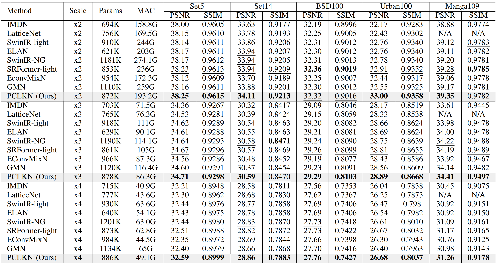
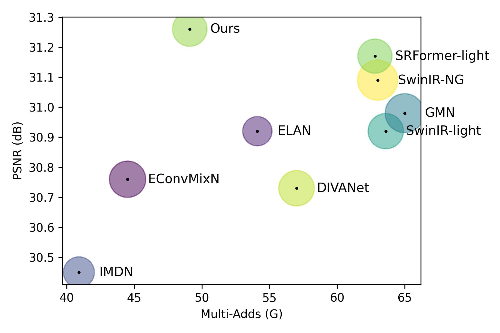
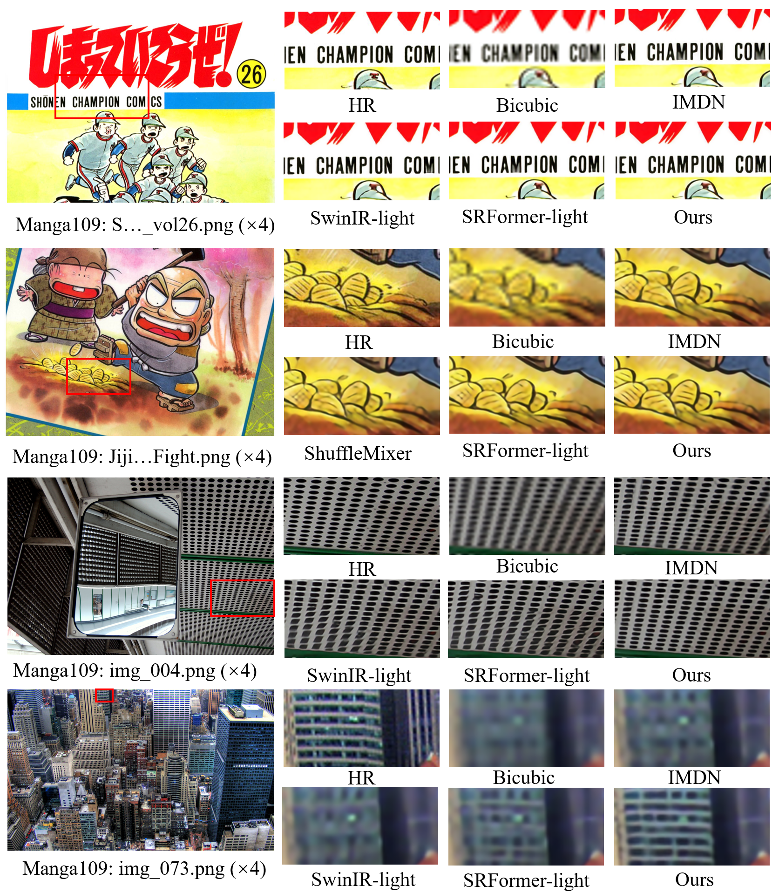

# PCLKN
This repository is an official implementation of the paper "Adaptive Pixel Classification and Equivalent Large Kernels for Lightweight Image Super-Resolution" for ICME2025.


## 📊 Results
### Quantitative Comparison





### Visual Comparisons




## Training & Testing 
### Pretrained Models
 Download the [pretrained models](https://github.com/What-you-ever/PCLKN/releases/download/pretrained-models/pretrained-models.zip) for tesing or training.

### Datasets 
 
 Training and benchmark datasets can be downloaded from [DIV2K](https://data.vision.ee.ethz.ch/cvl/DIV2K/) and [benchmarks](https://cv.snu.ac.kr/research/EDSR/benchmark.tar), respectively. 

### Dependencies 

```bash
git clone https://github.com/What-you-ever/PCLKN.git

conda create -n PCLKN python=3.9
conda activate PCLKN

pip install -r requirements.txt
```

### Train

```bash
# x2 
python basicsr/test.py -opt options/test/PCLKNSR_x2.yml
# x3
python basicsr/test.py -opt options/test/PCLKNSR_x2.yml
# x4
python basicsr/test.py -opt options/test/PCLKNSR_x4.yml
```
### Test

```bash
# x2
python basicsr/test.py -opt options/test/PCLKNSR_x2.yml
# x3
python basicsr/test.py -opt options/test/PCLKNSR_x2.yml
# x4
python basicsr/test.py -opt options/test/PCLKNSR_x4.yml
```


## 🏅 Acknowledgements

This project is built on [BasicSR](https://github.com/XPixelGroup/BasicSR) and [ATD](https://github.com/LabShuHangGU/Adaptive-Token-Dictionary). Special thanks to their excellent works!
